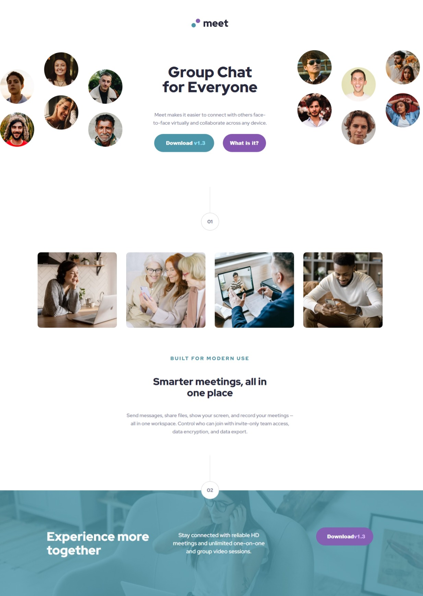

# landing-page
This repository contains the source code for a landing page.

## Table of contents
- [Overview](#overview)
    - [Screenshot](#screenshot)
    - [Links](#links)
- [Process](#process)
    - [Tools used](#tools-used)
    - [What I learned](#what-i-learned)
- [Author](#author)
- [Acknowledgement](#acknowledgement)

## Overview
### Screenshot

### Links
- [Github repository](https://github.com/EmmanuelAfrifa/landing-page)
- [Deployed site](https://meetlanding.netlify.app/)

## Process
### Tools Used
- HTML5
- CSS
- Flexbox

### What I learned
I learned that it is useful to use Flexbox for the layout of the page since it allows for flexible position of elements in the page. Also with regards to the media queries, the code becomes fewer and easily understandable when you abstract all the code that is common to the various device sizes and only add the device-specific properties inside the media queries.

## Author
- Emmanuel Afrifa
- [Email](emmanuel.afrifa@amalitech.org)
- [Twitter](https://twitter.com/Emma33712365)
- [Linkedin](https://www.linkedin.com/in/emmanuel-afrifa-840674214/)

## Acknowledgement
- [AmaliTech Graduate Training Program](https://amalitech.org/)
- [FreeCodeCamp Responsive Web Design](https://www.freecodecamp.org/learn/responsive-web-design/)